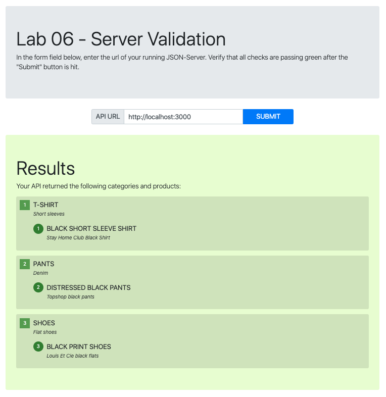

# Lab06

Author: Sian Culligan

Links and Resources
- submission PR

Setup/How to initialize & run your application 
- json-server --watch ./data/db.json
- http://localhost:3000/

How do you run tests?
- [Go here](https://server-validation-lab-06.netlify.com/)
- Enter ``http://localhost:3000/``

Any tests of note?
Describe any tests that you did not complete, skipped, etc
- All tests pass

